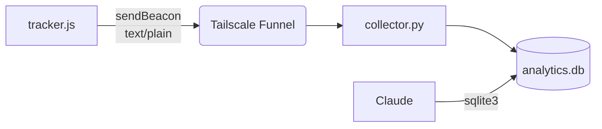

# Loop

Self-hosted analytics where Claude is the entire analytics layer. No dashboard, no UI — Claude reads SQLite directly, analyzes traffic, changes the site (content, UTM tags, copy), and measures what happened. That's the loop: **analyze → change → measure → repeat**.

A JS tracker snippet, a Python collector, and a SQLite database. That's it.

## How It Works



1. Visitor loads a page → `tracker.js` fires a `sendBeacon` POST with the path, referrer, and UTM params
2. Tailscale Funnel terminates HTTPS and forwards to `collector.py` on `127.0.0.1:8080`
3. Collector validates the request, looks up the visitor's country, and inserts a row into SQLite
4. Claude reads the database directly via `sqlite3`, analyzes the data, and acts on it

## For Claude

This section is written for you. Your job is not just to answer questions about traffic — it's to close the loop: analyze what's happening, make changes (content, UTM tags, page structure), and measure the impact.

The database is at `/var/lib/loop-analytics/analytics.db`.

### Service health

```bash
# Is the collector running?
systemctl status loop-analytics

# Recent logs
journalctl -u loop-analytics -n 50 --no-pager
```

### Connecting

Always set `busy_timeout` — the collector may be writing when you read:

```bash
sqlite3 /var/lib/loop-analytics/analytics.db "PRAGMA busy_timeout=2000; <your query>"
```

### Schema

One table, eight columns:

```sql
page_views (
    timestamp    INTEGER NOT NULL,  -- UTC unix epoch
    path         TEXT NOT NULL,     -- e.g. "/about", trailing slash stripped
    referrer     TEXT,              -- full URL; NULL if direct visit or same-origin
    utm_source   TEXT,              -- from ?utm_source=
    utm_medium   TEXT,              -- from ?utm_medium=
    utm_campaign TEXT,              -- from ?utm_campaign=
    country      TEXT,              -- 2-letter ISO code (e.g. "US"), NULL if lookup failed
    session_id   TEXT               -- currently always NULL (reserved)
)
```

There is one index: `idx_page_views_timestamp` on `timestamp`.

### Data conventions

- Absent values are `NULL`, never empty string.
- `referrer` is `NULL` for direct visits and same-origin navigations (filtered client-side).
- `path` is normalized: trailing slash stripped unless the path is `/`.
- `timestamp` is always UTC unix epoch seconds.
- `country` is `NULL` when the MMDB file is missing, the IP lookup fails, or the visitor came without `X-Forwarded-For`.
- Rows older than 60 days are pruned automatically. Expect at most ~21k rows at 10k visitors/month.

### Useful patterns

Convert timestamps to human-readable dates:

```sql
SELECT datetime(timestamp, 'unixepoch') as time, path FROM page_views ORDER BY timestamp DESC LIMIT 10;
```

Filter to a time range (last 7 days):

```sql
WHERE timestamp > unixepoch() - 7*86400
```

Top pages:

```sql
SELECT path, COUNT(*) as views FROM page_views
WHERE timestamp > unixepoch() - 7*86400
GROUP BY path ORDER BY views DESC;
```

Traffic by country:

```sql
SELECT country, COUNT(*) as views FROM page_views
WHERE country IS NOT NULL
GROUP BY country ORDER BY views DESC;
```

Referrer breakdown:

```sql
SELECT referrer, COUNT(*) as views FROM page_views
WHERE referrer IS NOT NULL
GROUP BY referrer ORDER BY views DESC;
```

Daily traffic over time:

```sql
SELECT date(timestamp, 'unixepoch') as day, COUNT(*) as views
FROM page_views GROUP BY day ORDER BY day;
```

UTM campaign performance:

```sql
SELECT utm_source, utm_medium, utm_campaign, COUNT(*) as views
FROM page_views WHERE utm_source IS NOT NULL
GROUP BY utm_source, utm_medium, utm_campaign ORDER BY views DESC;
```

### What you can't answer from this data

- **Session duration or bounce rate** — `session_id` is not yet implemented; each row is a single page view with no linking between views from the same visitor.
- **Returning vs new visitors** — no visitor identifier is stored.
- **Browser, OS, or device** — user agent is not recorded.
- **Exact visitor count** — one page view = one row. A visitor viewing 3 pages creates 3 rows.
- **Visitors with JS disabled or ad blockers** — these block the beacon entirely.

## Setup

### 1. Configure

Edit `collector.py` — set `ALLOWED_ORIGIN` to your site's URL:

```python
ALLOWED_ORIGIN = "https://yoursite.com"
```

Edit `tracker.js` — set the collector URL to your Tailscale Funnel address:

```javascript
var url = "https://yourmachine.tailnet.ts.net/collect";
```

### 2. Install dependencies

```bash
pip install maxminddb
```

Download the [DB-IP Lite country MMDB](https://db-ip.com/db/download/ip-to-country-lite) to `/var/lib/loop-analytics/dbip-country-lite.mmdb`. Country lookup is optional — if the file is missing, all rows get `country = NULL`.

### 3. Deploy

```bash
# Create system user and data directory
sudo useradd --system --no-create-home --shell /usr/sbin/nologin loop-analytics
sudo mkdir -p /var/lib/loop-analytics
sudo chown loop-analytics:loop-analytics /var/lib/loop-analytics
sudo chmod 750 /var/lib/loop-analytics

# Install and start the service
sudo cp loop-analytics.service /etc/systemd/system/
sudo systemctl enable --now loop-analytics

# Expose via Tailscale Funnel
sudo tailscale funnel --bg 8080
```

### 4. Add tracker to your site

Include `tracker.js` in your static site's HTML with a `<script>` tag.

## Design Decisions

- **No dashboard.** Claude runs arbitrary SQL. A dashboard is code to maintain that adds no value.
- **No rate limiting.** Behind Tailscale Funnel at ~350 req/day. Origin validation handles abuse.
- **No threading.** At 0.004 req/s, request overlap is impossible. Single-threaded avoids SQLite concurrency concerns.
- **sendBeacon with text/plain.** Avoids CORS preflight. Server-side Origin check is the real defense.
- **60-day retention.** Auto-pruned hourly. At 10k visitors/month, that's ~21k rows max.

See the [plan](docs/plans/2026-03-16-feat-simple-self-hosted-analytics-plan.md) for the full rationale and what was deliberately left out.
